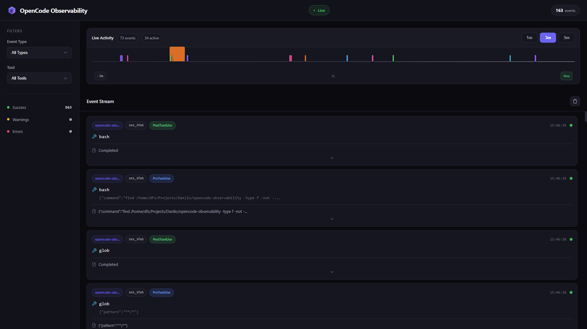

# OpenCode Observability

Real-time monitoring and visualization for OpenCode agents.



## Quick Start

### 1. Install Bun

```bash
curl -fsSL https://bun.sh/install | bash
```

### 2. Install the Plugin

```bash
./scripts/setup.sh
```

### 3. Start the System

```bash
./scripts/start-system.sh
```

Opens:
- Dashboard: http://localhost:5173
- API: http://localhost:4000

This installs a **global plugin** that tracks ALL your OpenCode sessions across ALL projects.

**Restart OpenCode** to activate.

## Requirements

- **Bun** 1.0+
- **OpenCode** (the AI agent)
- **Linux, WSL, or macOS**

## What It Tracks

- Tool executions (before/after)
- Session lifecycle (created, idle, error, stopped)
- Messages and permissions
- Full I/O capture with JSON details

## Event Flow

```
OpenCode → Plugin → HTTP POST → Bun Server → SQLite → WebSocket → Vue Dashboard
```

## Configuration

Optional environment variables:

```bash
# Server (apps/server/.env)
PORT=4000
DB_PATH=./data/events.db

# Plugin (.env.opencode.observability)
OPENCODE_OBSERVABILITY_URL=http://localhost:4000
```

## Credits

Inspired by [claude-code-hooks-multi-agent-observability](https://github.com/disler/claude-code-hooks-multi-agent-observability) by [@disler](https://github.com/disler).

## License

MIT